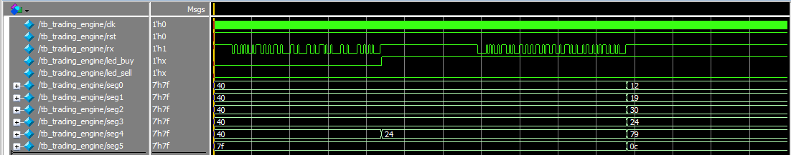

# UART Trading Engine

This open-source FPGA project implements a basic trading signal engine with real-time UART input parsing, decision output to LEDs based on basic trading logic, and a seven-segment display interface.

The project was originally designed for use with the Terasic DE1-SoC dev board but features simple enough logic to be translatable to other boards, barring maybe the display interface. In cases where your board does not have enough seven-segment displays (6), you can omit the driver module for the interface from the top-level file without consequence to the rest of the logic.

The project is my first adventure into Verilog design, and I hope the release of this project can help those starting their journey also gain stable footing. Feel free to use any of the code as you see fit, as the project is released under the MIT license. 

## UART?

Universal Asynchronous Receiver/Transmitter (UART) is a hardware communication protocol that facilitates serial data exchange between devices. UART transmits data serially (one bit at a time) and asynchronously (without a shared clock) over two wires. UART has an active-low start bit, meaning the device transmits bits with value 1 while idling until it transmits 0 for a period to indicate the start of the transmission. The most common configuration is one start bit followed by 8 data bits followed by one stop bit, totaling 10 bits for one transmission.

  
*Source: [V. Hunter Adams](https://vanhunteradams.com/Protocols/UART/UART.html)*

Hold on, if they're asynchronous... how do they know when to differentiate two bits of the same value? Good question!  
The devices don't need to share the same clock, but the protocol still requires that both devices share the same BAUD rate. The BAUD rate is the measure of the number of changes to the signal per second. If two devices have different BAUD rates, it's easy to see that one device will send bits at a wildly different rate than the other device is actually expecting to receive them, possibly using the previous bit for the next value or vice versa. The BAUD rate, in combination with the start bit, lets the receiving device correctly time when it is safe to consider the bit it is seeing transmitted the next bit. Safe to say, both devices must share the same BAUD rate in order to correctly time the capture of each individual bit.

Most devices nowadays in fact do not natively support UART but instead feature USB ports. This is a bit of a pain for our purposes, but some forethinking engineers have come up with a solution. The device we will use is called a USB-to-TTL Serial Adapter (basically UART-to-Serial), and can be had on Amazon for as little as 5 dollars. They plug into your computer, and you need to use jumper cables to connect them into the GPIO of your dev board. These adapters sometimes come in two flavours of voltages, so make sure to get the one that matches your dev board, although usually, they come in a combination model with various methods to switch voltages. My adapter came with a voltage-variating header, so I could adjust which pins were connected to get 3.3V logic to transmit, matching the GPIO voltage of my dev board.

  
*Source: [Lyons Computer](https://www.lyonscomputer.com.au/Electronic-Modules/USB-to-TTL-UART-YP-05-FTDI-FT232L/USB-to-TTL-UART-YP-05-FTDI-FT232L.html)*

For this project, we only need to use the transmission line (TX) and the ground pin (GND). TX, as implied by the name, facilitates the transmission of data, and GND keeps both components at the same electrostatic potential.

For completeness, I shall describe the other lines. VCC transmits power in case the board you're communicating with doesn't feature its own power supply. RX is the receive line in case your board communicates back with the transmitting device. DTR and CTS are additional timing signals. DTR stands for Data Terminal Ready and indicates that a device is ready to send data. CTS stands for Clear To Send and indicates that a device is allowed to send data.


## Design

This project combines a Verilog hardware design with supporting Python scripts to demonstrate and test its functionality.

### Trading Engine (Top Level)

The Trading Engine file is a top-level file that houses the modular design and serves to interconnect the Receive Line (RX), Parser, and SevenSeg Driver. It contains needed registers to ensure that the engine functions as intended. Additionally, the trading engine currently contains the execution of two basic trading strategies (breakout and breakdown), but can be modularized further to include custom strategy modules.

### UART_RX

The UART Receive Line (RX) implements a simple 4-state FSM in order to capture the incoming data. The module remains in an idle state until it detects a start bit, after which it enters a start state to calibrate the timing. The start state waits half the number of clocks for one bit to transmit, starts a one-bit timer, and enters the data state. The data state waits until the timer counts down to capture the incoming bit, so it waits out the time the start bit transmits, avoiding its capture. The data state collects the 8 data bits with a different index to keep track of the number of data bits. Once 8 have been captured, the module enters a stop state to provide the data to the parser module for one clock cycle.

### UART_Parser

Similarly to the Receive Line, the UART Parser also implements an FSM to convert the ASCII data into machine code for processing. The parser first determines which data is being sent by reading the first letter of the transmission. The module then enters a state to ignore the rest of the header until numeric characters start transmitting. Once the module detects numbers, it collects those until a newline character, stores them, and switches state to the convert state. The convert state uses known ASCII values to calculate the real value of the data and appends them to a temporary value to be stored in the register. The state reads the most significant number first, so for every additional number, it multiplies the temporary value by ten before adding the new number. Once all numbers are converted, it enters a store state to provide the transformed data to the engine and an additional signal for the Seven Segment Driver.

### SevenSeg_Driver

The Seven Segment Driver actively displays the current number in the threshold register by using a Look-Up Table to encode the numbers onto the Seven-Segment Displays. If a new price has been detected from the Parser module, the module encodes the value in the price register with an appended 'P' to indicate the difference and displays that on the Seven-Segment Displays. The new price displays for half a second, and if a new price is sent during that time, then the timer resets to display that new price for half a second. The driver uses the Double Dabble algorithm to convert from binary to binary coded decimal for display. Information about the Double Dabble algorithm can be found online, but I referenced [Binary to BCD (Double Dabble Algorithm) - Computerphile](https://www.youtube.com/watch?v=eXIfZ1yKFlA).

### Varying Price Python Script

The Varying Price Python script sets a pre-determined threshold. This threshold value becomes the previous price value. Every 2 seconds it randomizes a new price within 50 cents of the previous price value and sends that new price to the board.

### Varying Price-Threshold Python Script

The Varying Price-Threshold Python script performs a similar function to the simple Varying Price script. The difference is that it implements a new previous threshold value that is first instantiated by the pre-determined threshold. Every 10 seconds a new threshold is randomized within 1 dollar of the previous threshold value and sends that new threshold to the board. The new price will not be sent during a cycle a threshold is sent.


## Simulation

To verify the behavior of this design without deploying to hardware, you can run the included `tb_trading_engine.v` testbench using **Questa**.

### How to Simulate

1. **Open Questa**.

2. **Choose a directory for the test files and open it in Questa**.

3. **Add and ensure the following Verilog files are in the same directory**:
    - `trading_engine.v`
    - `uart_parser.v`
    - `uart_rx.v`
    - `sevenseg_driver.v`
    - `tb_trading_engine.v`

4. **Compile All Files:**
    - Click `Compile > Compile All` on the top toolbar.

5. **(IMPORTANT) Run Simulation with Signal Visibility:**
    - In the terminal type the following:
        ```bash
         vsim -voptargs="+acc" tb_trading_engine
         ```

6. **Add Signals to Waveform:**
    - Add all the signals you want to observe onto the waveform.
    - Some suggestions of signals to observe are LED_BUY, LED_SELL, RX, and CLK.

7. **Run the Simulation:**
    - In the terminal type the following:
        ```bash
        run 5ms
        ```
    - Make sure to adjust the zoom range of the waveform.
    - This is what your simulation should look like:
    
    


## Setup, Programming and Usage

### Software Requirements

- [Intel Quartus Prime Lite Edition](https://www.intel.com/content/www/us/en/software-kit/683393/intel-quartus-prime-lite-edition-design-software-version-23-1-for-windows.html) (tested with version 23.1 or later)
- ModelSim-Intel FPGA Edition (for simulation, optional)
- Python 3.8+ (tested with Python 3.13.5) with `pyserial` installed:
     ```bash
     pip install pyserial
     ```
- Your favourite IDE

### Hardware Requirements

- Development board of your choice (I use Terasic's DE1-SoC Rev.G)
    - Seven-Segment Displays not necessary. If not using, exclude module from synthesis.
- USB-Blaster (for programming the FPGA)
- USB-UART Serial Adapter
- 2x Jumper Wire
- USB Cable
- Computer (tested with Windows 10)

### Setup & Synthesis

1. **Clone or download this repository**:
     ```bash
     git clone https://github.com/your-username/trading-engine-fpga.git
     ```

2. **Open the project in Quartus**:
   - Create a new Quartus project.
   - Add all Verilog files from the `src/` directory to the project.
   - Assign pins in the Assignment Editor:
      - `clk` → `CLK_0`
      - `rx` → `GPIO_0`
      - `led_buy` → `LED_0`
      - `led_sell` → `LED_1`
      - `rst` → `BTN_0`
      - `seg0` → `HEX_0`
      - `seg1` → `HEX_1`
      - `seg2` → `HEX_2`
      - `seg3` → `HEX_3`
      - `seg4` → `HEX_4`
      - `seg5` → `HEX_5`
    - Create a `.sdc` file with your system constraints. For example, in my `.sdc` file:
         ```bash
         create_clock -name clk -period 20.0 [get_ports clk]
         ```
    - Last two steps not neccasary if using Terasic DE1-SoC Rev.G board. Check `constraints/` directory for my `.qsf` and `.sdc` files. :D

3. **Compile the design**:
     - Click `Start Compilation` in Quartus.
     - Address any warnings or errors.

4. **Program the FPGA**:
     - Open the **Programmer** via `Tools > Programmer`.
     - Load the compiled `.sof` file generated from your Quartus project.
     - Select the USB-Blaster as your hardware interface.
     - Click `Start` to program the FPGA board.

### Usage

1. **Connect computer, adapter, and board**:
     - Connect `USB` cable to `UART` adapter.
     - Connect `GND` port of adapter to `GPIO GND` of your Dev board.
     - Connect `TX` port to `GPIO_0` of your Dev board.
         - (Always connect `GND` first)

2. **Configure Python Scripts**:
     - Ensure `COM` variable set to correct COM port in-use.
     - Ensure `BAUD` variable set to the same variable compiled onto board.
        - Also ensure that `BAUD` rate is appropriately set in the system properties of the connection.

3. **Send Data and Observe**:
     - Run Python script.
         ```bash
         python Scripts/vary_price.py
         ``` 
         ```bash
         python Scripts/vary_price_threshold.py
         ```
         ```bash
         python Scripts/your_custom_script.py
         ```
     - Observe updating displays, as well as the updating LEDs:
        - LED_0 is on when BUY signal is activated, i.e. when price is lower than threshold.
        - LED_1 is on when SELL signal is activated, i.e. when price is higher than threshold.


## Demonstration

Check out this YouTube video I made demonstrating the functionality of the board.

[](https://www.youtube.com/watch?v=pcONWwadoqw)


## Looking Ahead

To limit the scope of the project, as it was my first in Verilog, I decided to omit some features that may have been too tough to implement for purely academic purposes.
Some things to think about including may be:
   
- Output functionality from the board. This should be pretty simple to actually develop but the issue is figuring out what to do with the data coming out. You could have a UART TX line feed back through to the host that is transmitting data in the first place, however, this wouldn't too closely match real world applications. Another implementation could be using each of the free GPIO pins to feed a specific buy/sell signal to a different processor. 
- Trading strategy modules. Momentum triggers, mean reversion, price velocity/rebound - the possibilites are endless.
- Multiple tickers. Currently the board is programmed to monitor and strategize on one ticker. Adding multiple tickers would require modifying the incoming data, as well as the parser, and most likely the addition of a module to store and handle the strategy execution on these.  